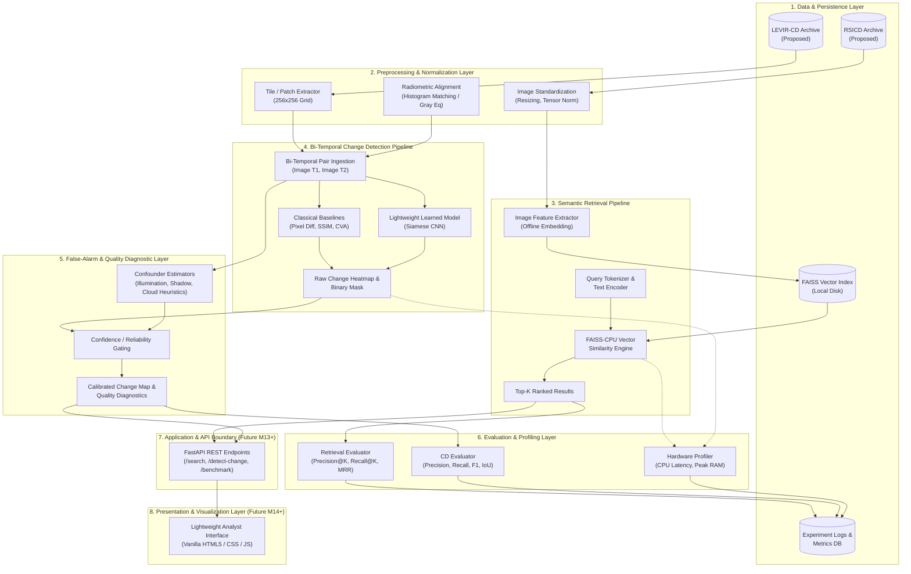
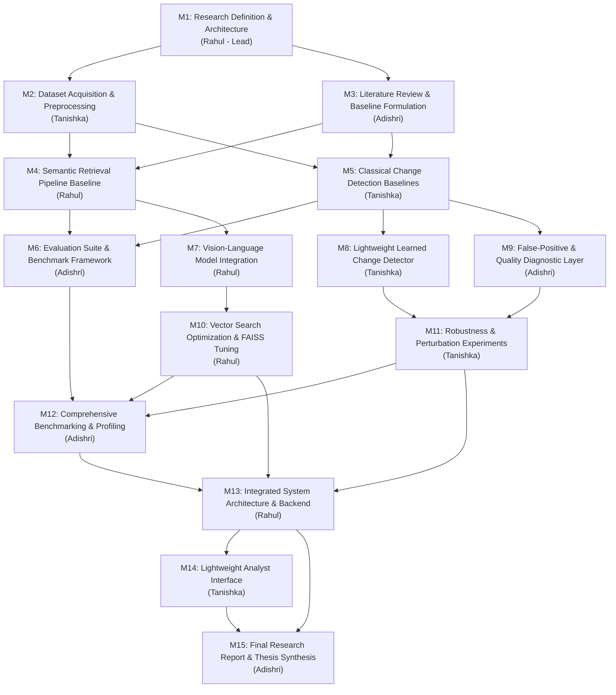

# System Architecture & Modular Design

**Document Version:** 1.0.0 (Milestone 1 — Baseline Definition)  
**Author:** Rahul (Team Lead)  
**Target Execution Environment:** Commodity CPU / Student Laptop Hardware  

---

## 1. High-Level Architecture Overview

The system is structured as a **modular, decoupled research architecture** comprising eight distinct layers. The dual capabilities (Semantic Retrieval and Temporal Change Detection) share common data and preprocessing conventions but operate independently at the model and inference levels, converging at the diagnostic and visualization boundaries.



---

## 2. Detailed Module Boundaries & Responsibilities

To ensure independent development across team members without code coupling, strict interface contracts and anti-responsibilities are defined.

### 2.1 Module 1: Data & Persistence Layer
- **Purpose:** Manages raw image files, ground-truth masks, vector indices, and experiment outcome files on local disk.
- **Inputs:** Local directory paths, archive pointers, pre-split lists.
- **Outputs:** File handles, memory-mapped tensors, serialized indices, SQLite/JSON metric logs.
- **Key Responsibilities:**
  - Standardized dataset partitioning (Train / Validation / Test).
  - Caching precomputed embeddings and FAISS index persistence.
  - Tracking metadata (spatial dimensions, sensor types, timestamps).
- **Dependencies:** Standard OS filesystem, `sqlite3`/`json`.
- **Anti-Responsibilities (Must NOT do):**
  - Must not perform feature extraction or model inference.
  - Must not perform image augmentation or resizing on the fly without abstraction.

### 2.2 Module 2: Preprocessing & Normalization Layer
- **Purpose:** Transforms raw imagery into model-ready tensors and calibrated pairs.
- **Inputs:** Raw RGB/multispectral images ($T_1, T_2$, or single query candidate images).
- **Outputs:** Standardized, normalized tensors ($\mathbb{R}^{C \times H \times W}$), tiled patches ($256 \times 256$), co-registered arrays.
- **Key Responsibilities:**
  - Tiling large remote sensing scenes into manageable, fixed-dimension sub-patches for CPU processing.
  - Normalization (ImageNet channel statistics or remote-sensing min-max scaling).
  - Radiometric alignment options (histogram matching, gamma correction, or grayscale equalization).
- **Dependencies:** `Pillow`, `OpenCV`, `NumPy`, `torchvision.transforms`.
- **Anti-Responsibilities (Must NOT do):**
  - Must not execute change detection logic.
  - Must not directly communicate with API clients or user interfaces.

### 2.3 Module 3: Semantic Retrieval Pipeline
- **Purpose:** Executes cross-modal vision-language text-to-image semantic search.
- **Inputs:** Free-form text query string (e.g., *"circular irrigation fields"*), candidate image embeddings, query parameter $K$.
- **Outputs:** Ranked list of $K$ image identifiers, similarity scores ($[-1.0, 1.0]$), and latency metadata.
- **Key Responsibilities:**
  - Query tokenization and vector projection via lightweight text encoder.
  - Managing cosine similarity search via `faiss-cpu`.
  - Offline pre-indexing of dataset imagery.
- **Dependencies:** Pretrained vision-language model (e.g., CLIP-CPU), `faiss-cpu`, `NumPy`.
- **Anti-Responsibilities (Must NOT do):**
  - Must not perform change detection or image difference operations.
  - Must not depend on the change detection model weights.

### 2.4 Module 4: Bi-Temporal Change Detection Pipeline
- **Purpose:** Identifies pixel-level and region-level differences between co-registered image pairs ($T_1, T_2$).
- **Inputs:** Synchronized image pair tensors $(X_{T1}, X_{T2}) \in \mathbb{R}^{2 \times C \times H \times W}$.
- **Outputs:** Continuous change probability heatmap $\in [0, 1]^{H \times W}$, binary change mask $\in \{0, 1\}^{H \times W}$, execution latency.
- **Key Responsibilities:**
  - Implementing classical comparison baselines:
    - Absolute pixel differencing with adaptive thresholding (Otsu).
    - Structural Similarity Index Measure (SSIM) difference map.
    - Change Vector Analysis (CVA) in spectral/color space.
  - Implementing lightweight learned change detector (e.g., Siamese CNN / Tiny-UNet with feature difference).
- **Dependencies:** `OpenCV`, `PyTorch (CPU)`, `scikit-image`, `NumPy`.
- **Anti-Responsibilities (Must NOT do):**
  - Must not process text queries or interact with FAISS indices.
  - Must not hard-code presentation logic.

### 2.5 Module 5: False-Alarm & Quality Diagnostic Layer
- **Purpose:** Evaluates radiometric and spatial consistency to flag suspected non-ground artifacts.
- **Inputs:** Raw change heatmap, source pair $(X_{T1}, X_{T2})$, estimated scene metadata.
- **Outputs:** Reliability/confidence mask, confounder diagnostic flags (illumination gradient indicator, shadow shift flag, cloud heuristic flag), calibrated change mask.
- **Key Responsibilities:**
  - Measuring global illumination shift via mean luminance and chromaticity delta.
  - Detecting transient high-intensity reflections or saturated cloud pixels via classical color-threshold heuristics.
  - Down-weighting change probability in regions flagged as illumination or shadow artifacts.
- **Dependencies:** `NumPy`, `OpenCV`, `scikit-image`.
- **Anti-Responsibilities (Must NOT do):**
  - Must not replace the primary change detector; it acts solely as a post-processor and diagnostic annotator.

### 2.6 Module 6: Evaluation & Profiling Layer
- **Purpose:** Computes rigorous empirical metrics across both pipelines and benchmarks hardware resource utilization.
- **Inputs:** Model predictions, ground-truth labels/masks, wall-clock start/end markers, process memory hooks.
- **Outputs:** Metric summaries (Precision, Recall, F1, IoU, Precision@K, Recall@K, MRR), CPU time (ms/sample), peak RAM (MB), parameter counts.
- **Key Responsibilities:**
  - Standardized, reproducible metric evaluation against fixed ground truth.
  - Hardware profiling using Python's `time.perf_counter` and `psutil` or `tracemalloc`.
  - Generating comparative markdown and CSV benchmark tables.
- **Dependencies:** `scikit-learn`, `NumPy`, `psutil`, `pandas`.
- **Anti-Responsibilities (Must NOT do):**
  - Must not alter model weights or modify raw datasets.

### 2.7 Module 7: Serving & API Layer (Future — Milestone 13+)
- **Purpose:** Provides clean, decoupled RESTful endpoints for model invocation and system demonstrations.
- **Inputs:** HTTP POST/GET requests (JSON query string, uploaded bi-temporal image pair).
- **Outputs:** JSON responses with ranked image IDs, base64-encoded change masks, diagnostic metadata, and timing stats.
- **Key Responsibilities:**
  - Request validation and serialization.
  - Routing calls to Module 3 (Retrieval) or Module 4 & 5 (Change Detection & Diagnostics).
- **Dependencies:** `FastAPI`, `Uvicorn`, `Pydantic`.
- **Anti-Responsibilities (Must NOT do):**
  - Must not contain model training logic or raw metric calculation logic.

### 2.8 Module 8: Presentation & Visualization Layer (Future — Milestone 14+)
- **Purpose:** Provides an intuitive, responsive graphical user interface for researchers and geospatial analysts.
- **Inputs:** User clicks, typed queries, image file selections.
- **Outputs:** Rendered visual feedback: gallery of retrieved satellite scenes, side-by-side $T_1 / T_2$ sliders, overlaid change masks, and confidence indicators.
- **Dependencies:** Modern Browser, HTML5 Canvas, Vanilla CSS, Vanilla JavaScript.
- **Anti-Responsibilities (Must NOT do):**
  - Must not execute any computer vision or machine learning math directly in JavaScript; all computation remains on the Python backend.

---

## 3. End-to-End Execution & Data Flows

### 3.1 Flow A: Semantic Retrieval Pipeline
```
[User Text Query]
       │
       ▼
1. Query Sanitization & Truncation (ASCII/UTF-8)
       │
       ▼
2. Tokenizer & Lightweight Text Encoder (PyTorch CPU)
       │
       ▼
   Embedding Vector e_q ∈ ℝ^D (e.g., D = 512, L2-normalized)
       │
       ▼
3. Vector Similarity Search (FAISS-CPU IndexFlatIP / IndexIVFFlat)
       │
       ▼
   Candidate IDs & Cosine Distances: [(ID_1, s_1), ..., (ID_K, s_K)]
       │
       ▼
4. Metadata Hydration (Resolve IDs to File Paths, Spatial Tags)
       │
       ▼
[Ranked Output Gallery + Similarity Scores]
```

### 3.2 Flow B: Bi-Temporal Change Detection Pipeline
```
[Image T1 (Pre)]               [Image T2 (Post)]
       │                              │
       └──────────────┬───────────────┘
                      ▼
1. Pair Validation & Spatial Alignment Check (Dimensions, Channels)
                      │
                      ▼
2. Preprocessing & Tiling (256×256 Grid, Normalization)
                      │
                      ▼
3. Dual-Stream Feature Extraction / Comparison
   ├─ Classical Branch: Pixel Differencing / SSIM / CVA
   └─ Learned Branch: Lightweight Siamese CNN (Forward Pass CPU)
                      │
                      ▼
4. Raw Change Map Generation (Pixel Probability Matrix M ∈ [0, 1]^(H×W))
                      │
                      ▼
5. Quality Diagnostic Assessment
   ├─ Luminance Shift Detection (Δμ_L)
   └─ Cloud/Shadow Artifact Filtering
                      │
                      ▼
6. Thresholding & Confidence Mask Generation
   ├─ Binary Mask: M_bin = (M ≥ τ) ∧ (Confidence ≥ θ_conf)
   └─ Diagnostic Metadata (False-positive risk score)
                      │
                      ▼
[Output Binary Change Mask + Heatmap + Diagnostic Report]
```

---

## 4. Hardware & CPU Execution Design

To satisfy the strict **commodity student laptop / CPU-only execution** constraint:
1. **Thread Optimization:** Limit OpenMP, MKL, and PyTorch threads (`torch.set_num_threads(4)`) to avoid CPU thread thrashing and battery depletion on quad-core laptops.
2. **Batch Sizing for Inference:** Use batch size $B=1$ (or small batches $B \le 4$) during CPU inference to bound transient RAM spikes.
3. **Patch-Based Processing:** Remote sensing images exceeding $512 \times 512$ pixels will be processed via non-overlapping or minimally overlapping $256 \times 256$ windowing, bounding memory allocation to $< 50$ MB per tile tensor.
4. **Vector Quantization / Flat Indexing:** With manageable evaluation datasets (e.g., RSICD with $\sim 10^4$ images), a standard `IndexFlatIP` (exhaustive inner product search) requires only $\approx 10,921 \times 512 \times 4\text{ bytes} \approx 22.3\text{ MB}$ of RAM, allowing instantaneous CPU nearest-neighbor lookups ($< 2$ ms per query) without GPU hardware.
5. **Model Parameter Cap:** Neural backbones for change detection will target $< 5$ million parameters, ensuring lightweight memory footprints and fast forward-pass latency on standard CPUs.

---

## 5. Milestone Dependency Structure

The 15-milestone roadmap is architected to ensure systematic progression with clearly defined handoffs between the three team members:



### Dependency Explanations:
- **M2 & M3 depend on M1:** Dataset curation parameters (patch size, format) and literature targets are guided by the architecture and research questions formalized in M1.
- **M4 & M5 depend on M2 & M3:** Model implementation cannot begin without clean, verified data splits (M2) and established mathematical baseline specifications (M3).
- **M6 depends on M4 & M5:** The automated evaluation suite requires functional baseline implementations to compute first empirical metrics.
- **M7 & M8 depend on M4 & M5:** Advanced vision-language models and learned neural detectors must be evaluated directly against established baselines under identical protocols.
- **M9 depends on M5:** False-alarm diagnostic mechanisms must operate on real baseline change-map failure cases to establish calibration.
- **M10, M11, M12 depend on M7, M8, M9:** Systematic ablation, perturbation analysis, and FAISS indexing require stabilized models.
- **M13 depends on M10, M11, M12:** System integration into FastAPI occurs only after all models and evaluation metrics are thoroughly finalized.
- **M14 & M15 depend on M13:** The web interface and final dissertation/research paper synthesize the verified integrated system.
